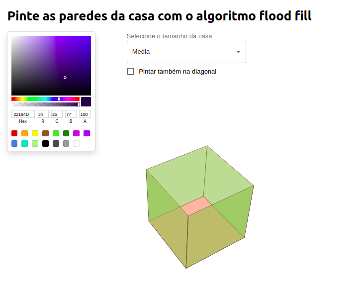
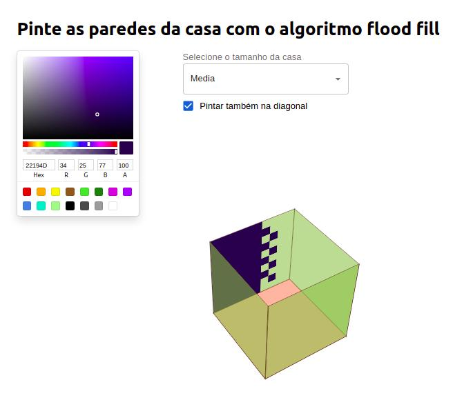
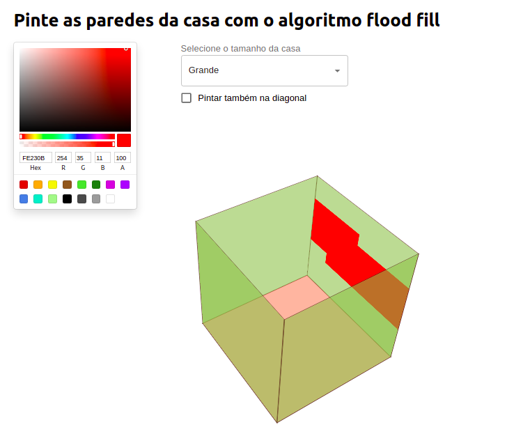

# Flood fill

**Número da Lista**: 1<br>
**Conteúdo da Disciplina**: Grafos 1<br>

## Alunos

| Matrícula  | Aluno                 |
| ---------- | --------------------- |
| 18/0125885 | Lucas Melo dos Santos |

## Sobre

O projeto utiliza o algoritomo de flood fill para pintar uma caixa que simula as paredes de uma casa. No projeto é possível selecionar o tamanho da casa e também se deseja que o algoritmo possa enxegar os pixeis das diagonais ao visitar um nó.

Para que seja possível perceber o funcionamento do algoritmo existe um delay para pintura de cada pixel.

## Screenshots







## Instalação

**Linguagem**: Javascript<br>
**Framework**: React<br>

## Uso

```

cd Flood-fill/flood_fill

yarn

yarn start
```

## Outros

Quaisquer outras informações sobre seu projeto podem ser descritas abaixo.
